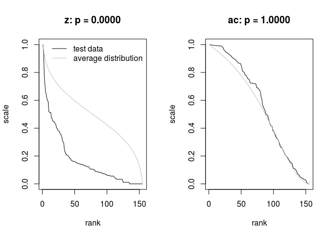

[](https://travis-ci.org/mpadge/hotspotr)
[](https://codecov.io/gh/mpadge/hotspotr)

# hotspotr 

There are a number of statistical tools for evaluating the significance of
observed spatial patterns of hotspots (such as those in
[`spdep`](https://cran.r-project.org/package=spdep)). While such tools enable
hotspots to be identified within a given set of spatial data, they do not allow
quantification of whether the entire data set in fact reflects significant
spatial structuring. For example, numbers of locally significant hotspots must
be expected to increase with numbers of spatial observations. 

The `R` package `hotspotr` enables the global significance of an observed
spatial data set to be quantified by comparing both raw values and their local
spatial relationships with those generated from a neutral model. If the global
pattern of observed values is able to be reproduced by a neutral model, then any
local hotspots may not be presumed significant regardless of the values of local
statistics. Conversely, if the global pattern is unable to be reproduced by a
neutral model, then local hotspots may indeed be presumed to be statistically
significant.

The package is inspired by the work of *Brown, Mehlman, & Stevens* (Ecology
1995) and *Ives & Klopfer* (Ecology 1997). `hotspotr` follows the same premises
as these two papers, in examining the extent to which rank--scale distributions
can be reproduced by simple neutral models. `hotspotr` compares rank--scale
distributions not only of the data of interest, but of corresponding local
autocorrelation statistics.

Analysis involves first fitting a model using the function
`fit_hotspot_model`, and then testing the significance of that using the
function `p-values`.

--------


# Contents

[1. Neutral hotspots](#1-neutral)

[2 Testing hotspot data](#2-hotspot-test)

[3 Parallel computation](#3-parallel)

[4. Analytic Distributions](#4-analytic-dists)

--------


## Install

```{r, eval=FALSE}
devtools::install_github ('mpadge/hotspotr')
```
```{r load, echo=FALSE, message=FALSE}
while (length (grep ('hotspotr', getwd ())) > 0) setwd ("..")
#devtools::document ("hotspotr")
#devtools::check ("hotspotr")
#Rcpp::compileAttributes ("hotspotr")
devtools::load_all ("hotspotr")
setwd ("./hotspotr")
#testthat::test_package ('hotspotr')
```

--------

# <a name="1-neutral"></a>1. Neutral hotspots

`hotspotr` works by simulating the statistical properties of a neutral model for
hotspot generation (with the model largely following Brown et al (*Ecology*
1995)). This model is applied to a specified set of spatial points and neighbour
lists, as illustrated with the following lines.
```{r}
size <- 10
xy <- cbind (rep (seq (size), each=size), rep (seq (size), size))
dhi <- 1 # for rook; dhi=1.5 for queen
nbs <- spdep::dnearneigh (xy, 0, dhi)
```

The function `neutral_hotspots` then generates a neutral model determined by the
three parameters:

1. sd0 = Standard deviation of the environmental variables;

2. alpha = Strength of spatial autocorrelation (with negative values
   acceptable); and

3. niters = Number of iterations of spatial autocorrelation simulated in model.

This function returns two vectors of simulated values:
```{r}
dat <- neutral_hotspots (nbs, alpha=0.1, sd=0.1, niters=1, ntests=1000)
dim (dat); head (dat)
```
The two columns are simulated raw values and autocorrelation statistics, both
sorted in decreasing order and scaled between 0 and 1, and so both providing
respective rank-scale distribution to be compared with observed rank-scale
distributions.

--------

## <a name="2-hotspot-test"></a>2 Testing hotspot data

The statistical significance of an observed vector of hotspot data and
corresponding list of neighbours (and optional neighbour weights) may be tested
by first fitting a hotspot model to desired test data. This is illustrated here
with topsoil heavy metal concentrations from the `sp` package:
```{r}
data (meuse, package='sp') 
names (meuse); dim (meuse)
z <- meuse ['cadmium'][,1] # a vector of 155 spatial values
```
Construct neighbour weights by inverse distances:
```{r meuse-data}
xy <- cbind (meuse$x, meuse$y)
nbs <- spdep::knn2nb (spdep::knearneigh (xy, k=4))
dists <- spdep::nbdists (nbs, xy)
d1 <- lapply (dists, function (i) 1/i)
wts <- lapply (d1, function (i) i / sum (i))
```
Fit a neutral model of hotspot generation:
```{r, eval=FALSE}
mod <- fit_hotspot_model (z, nbs=nbs, wts=wts, ntests=1000)
mod
```
```{r, echo=FALSE}
mod <- list (sd0=0.005103036, ac=0.261681, niters=6) # copper
mod <- list (sd0=0.000001, ac=0.3576799, niters=4) # cadmium
mod
```
And test the probability of such a model being randomly generated:
```{r p-values, eval=FALSE}
p_values (z=z, nbs=nbs, sd0=mod$sd0, alpha=mod$ac, niters=mod$niters,
          ntests=1e4, plot=TRUE)
```

```{r}
## $p_z
## [1] 0
## 
## $p_ac
## [1] 0.9999425
```

Revealing that the raw statistics are unable to be generated by a neutral model,
yet the spatial autocorrelation statistics do not differ significantly from
those of a neutral model.  This indicates that the generating processes can be
modelled by assuming nothing other than simple spatial autocorrelation acting on
a more complex, non-spatial process.

--------

## <a name="3-parallel"></a>3 Parallel computation

`neutral_hotspots` also has a `parallel` option that determines whether the
tests are conducting using an `Rcpp` (non-parallel) loop, or using `R:parellel`.
The latter may be faster under some circumstances for large numbers of tests,
although it will definitely be slower for smaller numbers because of the time
needed to establish the parallel clusters. Differences are illustrated here:

```{r rcpp-loop, eval=TRUE}
ntests <- 1000
set.seed (1)
st1 <- system.time (dat1 <- neutral_hotspots (nbs, ntests=ntests))
set.seed (1)
st2 <- system.time (dat2 <- neutral_hotspots (nbs, ntests=ntests,
                                              parallel=TRUE))
st1; st2
```

-------

## <a name="4-analytic-dists"></a>4. Analytic Distributions

Analytic rank-scale distributions can be obtained from the order statistic for a
normal distribution of `n` samples. The following function demonstrates that the
effect of adding multiple truncated normal distributions can be quantified
simply by changing the standard deviation of a single (non-iterated) probability
density function.

```{r}
plotdists <- function (sd=0.1, n=1e4, logx=TRUE, niters=1, p0, plot=TRUE)
{
    if (length (sd) == 1)
        sd <- rep (sd, 2)

    # --------   numerically simulated distribution
    xn <- rep (0, n)
    for (i in 1:niters)
        xn <- xn + truncnorm::rtruncnorm (n=n, a=0, b=2, mean=1, sd=sd [1])
    xn <- xn / niters
    if (logx) xn <- log10 (xn)
    x1 <- sort (xn, decreasing=TRUE)

    # --------   analytic distribution
    x <- seq (2, 0, length.out=n)
    xd <- truncnorm::dtruncnorm (x, a=0, b=2, mean=1, sd=sd [2])
    xd <- cumsum (xd / sum (xd))

    if (missing (p0)) p0 <- order_one (n=n, sigma=sd [2])

    indx <- which (x >= p0 & x <= (2 - p0))
    x <- x [indx]
    xd <- xd [indx]

    if (logx) x <- log10 (x) 

    if (plot)
    {
        plot (xd, x, "l", col="lawngreen", lwd=2, xlab="", ylab="")
        lines (seq (n) / n, x1, col="blue", lwd=2, lty=2)
        legend ("topright", lwd=1, lty=c(1, 2), col=c("blue", "lawngreen"),
                bty="n", legend=c("numeric", "analytic"))
    }

    # Then interpolate x onto regular xd to return matching rank-scale dist
    xout <- approx (x=xd, y=x, xout=seq (0, 1, length.out=n))
    if (plot)
        lines (xout$x, xout$y, col="orange", lwd=2, lty=2)
    # first and last values at [0,1] are always NA
    xout$y <- xout$y [2:(length (xout$y) - 1)]
    return (xout$y)
}
```

The left panel in the following figure demonstrates that distributions are equal
in the non-iterated case (`niters=1`), while the right demonstrate the
equivalence of multiple iterations to reductions in standard deviation. Note
that the second standard deviation of `0.05` is only a guess.
```{r analytic-dists, fig.width=12}
par (mfrow=c(1,2))
n <- 1000
sd <- 0.1
p0 <- order_one (n=n, sigma=sd)
junk <- plotdists (sd=sd, n=n, p0=p0, niters=1)
title (main="niters = 1")
junk <- plotdists (sd=c (sd, 0.05), n=n, p0=p0, niters=4)
title (main="niters = 4")
```

Hotspot models can thus be fitted using analytic probability densities which
depend on the single parameter of standard deviation. No re-scaling is
necessary, as a measure of fit can be obtained directly from the sum of squared
residuals of a linear regression between the observed values and those returned
from `plotdists`.

Finally, to demonstrate the flexibility offered by log-scaled distributions of
differing standard deviations (re-scaled here just to visualise them on the same
plot):
```{r sd-plots}
sds <- c (1e-5, 1e-4, 1e-3, 0.01, 0.1, 0.3, 1)
p0 <- c (0.9999471, 0.9995128, 0.9956159, 0.9614168, 0.6757358, NA, NA)
cols <- rainbow (length (sds))
plot (NULL, NULL, xlim=c(0, 1), ylim=c(0, 1), xlab="rank", ylab="scale")
for (i in 1:length (sds))
{
    if (!is.na (p0 [i]))
        y <- plotdists (sd=sds [i], n=100 / sds [i], p0=p0 [i], plot=FALSE)
    else
        y <- plotdists (sd=sds [i], n=100 / sds [i], plot=FALSE)
    y <- (y - min (y)) / diff (range (y))
    lines (1:length (y) / length (y), y, col=cols [i])
}
ltxt <- unlist (lapply (sds, function (i) paste0 ('sd=', i)))
legend ('topright', lwd=1, col=cols, bty='n', legend=ltxt)
```


