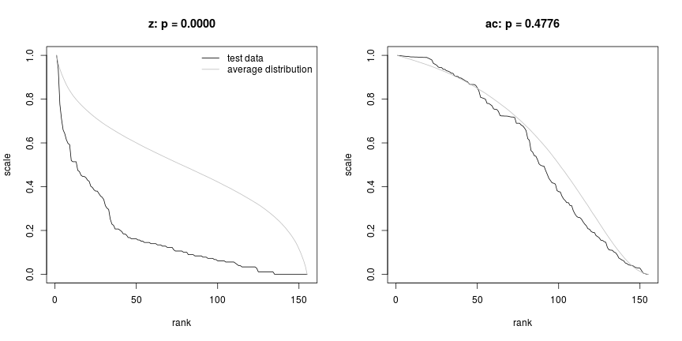
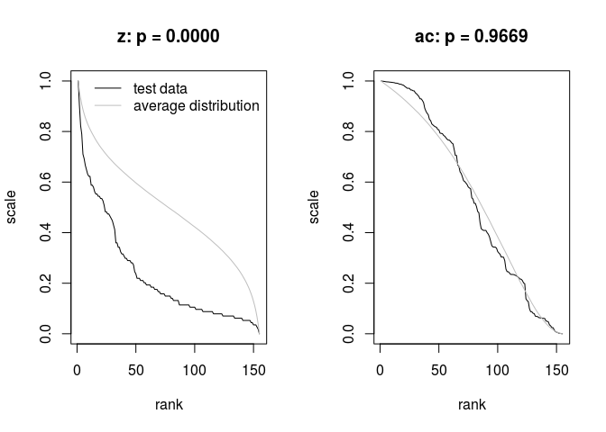

[](https://travis-ci.org/mpadge/hotspotr)
[](https://codecov.io/gh/mpadge/hotspotr)

# hotspotr (... work in progress ...)

There are a number of statistical tools for evaluating the significance of
observed spatial patterns of hotspots (such as those in
[`spdep`](https://cran.r-project.org/package=spdep)). While such tools enable
hotspots to be identified within a given set of spatial data, they do not allow
quantification of whether the entire data set in fact reflects significant
spatial structuring. For example, numbers of locally significant hotspots must
be expected to increase with numbers of spatial observations. 

The `R` package `hotspotr` enables the global significance of an observed
spatial data set to be quantified by comparing both raw values and their local
spatial relationships with those generated from a neutral model. If the global
pattern of observed values is able to be reproduced by a neutral model, then any
local hotspots may not be presumed significant regardless of the values of local
statistics. Conversely, if the global pattern is unable to be reproduced by a
neutral model, then local hotspots may indeed be presumed to be statistically
significant.

The package is inspired by the work of *Brown, Mehlman, & Stevens* (Ecology
1995) and *Ives & Klopfer* (Ecology 1997). `hotspotr` follows the same premises
as these two papers, in examining the extent to which rank--scale distributions
can be reproduced by simple neutral models. `hotspotr` compares rank--scale
distributions not only of the data of interest, but of corresponding local
autocorrelation statistics.

Analysis involves first fitting a model using the function
`fit_hotspot_model`, and then testing the significance of that using the
function `p-values`.

The remainder of this README documents various exploratory and development
phases ...

--------


# Contents

[1. Parallel and Rcpp Tests](#1-parallel)

[2. Tests](#2-tests)

--------


## Install

```{r, eval=FALSE}
devtools::install_github ('mpadge/hotspotr')
```
```{r load, echo=FALSE, message=FALSE}
while (length (grep ('hotspotr', getwd ())) > 0) setwd ("..")
#devtools::document ("hotspotr")
#devtools::check ("hotspotr")
#Rcpp::compileAttributes ("hotspotr")
devtools::load_all ("hotspotr")
setwd ("./hotspotr")
#testthat::test_package ('hotspotr')
```

--------

# <a name="1-parallel"></a>1. Parallel and Rcpp Tests

Five different versions are examined here:

1. A purely `R` version using `lapply`

2. A parallel equivalent using `parLapply`

3. An `R::lapply` on an internal `Rcpp` core

4. An `R::parLapply` on an internal `Rcpp` core

5. A (non-parallel) loop constructed entirely in `C++`

Fist set up grid and list of spaital neighbours
```{r}
ntests <- 10000
size <- 10
xy <- cbind (rep (seq (size), each=size), rep (seq (size), size))
dhi <- 1 # for rook; dhi=1.5 for queen
nbs <- spdep::dnearneigh (xy, 0, dhi)
```

```{r}
junk <- testn (nbs)
```

First time the pure `R` version:
```{r R-test, eval=TRUE}
set.seed (1)
st1 <- system.time (
    test1 <- neutral_hotspots (nbs=nbs, alpha=0.1, sd0=0.1, ntests=ntests)
)
```

Then an equivalent parallel version, still entirely `R`-scripted and currently
in `neutral-hotspots-ntests`:
```{r R-test-parallel, eval=TRUE}
set.seed (1)
st2 <- system.time (
    test2 <- neutral_hotspots_ntests (nbs=nbs, alpha=0.1, sd0=0.1, ntests=ntests)
)
```
That takes longer because of the time needed to establish the parallel
clusters, but the parallel version quickly becomes faster for higher values of
`ntests`.

Then current, non-parallel `Rcpp` version, called `neutral_hotspots2`, wrapped
here in an `lapply`.

```{r rloop, eval=TRUE}
rloop <- function (ntests=1000)
{
    dat <- lapply (seq (ntests), function (i) 
                 neutral_hotspots2 (nbs, alpha=0.1, sd0=0.1, ntests=ntests))
    z <- colMeans (do.call (rbind, lapply (dat, function (i) i [,1])))
    ac <- colMeans (do.call (rbind, lapply (dat, function (i) i [,2])))
    cbind (z, ac)
}
set.seed (1)
st3 <- system.time ( test3 <- rloop (ntests=ntests))
```

And then an `R`-internal parallel version. First the slightly different function
definition:
```{r rparallel-fn, message=FALSE, eval=TRUE}
require (parallel)
rParloop <- function (ntests=1000)
{
    dat <- parLapply (clust, seq (ntests), function (i) 
                    neutral_hotspots2 (nbs, alpha=0.1, sd0=0.1, ntests=ntests))
    z <- colMeans (do.call (rbind, lapply (dat, function (i) i [,1])))
    ac <- colMeans (do.call (rbind, lapply (dat, function (i) i [,2])))
    cbind (z, ac)
}
```
Note that `makeCluster` with `type="FORK"` automatically attaches all
environment variables, but is not portable, as detailed here:
[http://www.r-bloggers.com/how-to-go-parallel-in-r-basics-tips/](http://www.r-bloggers.com/how-to-go-parallel-in-r-basics-tips/).
The `clusterExport` and `clusterCall` lines explicitly attach only the required
bits.
```{r cluster-setup, eval=TRUE}
#clust <- makeCluster (parallel::detectCores () - 1, type="FORK")
clust <- makeCluster (parallel::detectCores () - 1)
clusterExport (clust, "nbs")
invisible (clusterCall (clust, function () {
                        while (length (grep ('hotspotr', getwd ())) > 0) 
                            setwd ("..")
                        devtools::load_all ("hotspotr")
                        setwd ("./hotspotr")
                                         }))
```
```{r rparallel-loop, eval=TRUE}
st4 <- system.time (test4 <- rParloop (ntests=ntests))
stopCluster (clust)
```
Then finally the whole loop over `ntests` constructed in `Rcpp`, and therefore
in non-parallel form.
```{r rcpp-loop, eval=TRUE}
set.seed (1)
st5 <- system.time (test5 <- neutral_hotspots_ntests2 (nbs, ntests=ntests))
```

The final system times are:
```{r}
st1; st2; st3; st4; st5
```

The parallel versions do not of course generate identical results, because each
core starts with its own random seed, but nevertheless after
```{r, eval=TRUE}
ntests
```
the differences are very small:
```{r, eval=TRUE}
max (abs (test1 - test2)); max (abs (test1 - test3)); max (abs (test1 - test4));
max (abs (test1 - test5))
max (abs (test2 - test3)); max (abs (test2 - test4)); max (abs (test2 - test5))
max (abs (test3 - test4)); max (abs (test3 - test5))
max (abs (test4 - test5))
```
These differences provide a measure of convergence of randomised mean profiles.


--------

# <a name="2-tests"></a>2. Tests

Test the distributional properties of the `meuse` data from the `sp` package,
which contain topsoil heavy metal concentrations near Meuse, NL.

```{r}
data (meuse, package='sp')
names (meuse)
```

The function `test_hotspots` requires data to be tested, a list of
neighbours (constructed here as `knearneigh`), and a matching list of weights
(constructed here as inverse-distance weights):
```{r meuse-data}
xy <- cbind (meuse$x, meuse$y)
nbs <- spdep::knn2nb (spdep::knearneigh (xy, k=4))
dists <- spdep::nbdists (nbs, xy)
# wts calculated in 2 steps to make it explicit
d1 <- lapply (dists, function (i) 1/i)
wts <- lapply (d1, function (i) i / sum (i))
```

Spatial patterns for the different metals can then be statistically compared
with neutral models:
```{r meuse-fn}
analyse <- function (metal='copper', ntests=1000)
{
    z <- meuse [metal] [,1]
    mod <- fit_hotspot_model (z=z, nbs=nbs, wts=wts, verbose=FALSE)
    p_values (z=z, nbs=nbs, sd0=mod$sd0, alpha=mod$ac, ntests=ntests, plot=TRUE)
}
```
For demonstration purposes, `ntests=1000` is sufficient, but larger values will
generate more reliable estimates. These functions can be quite time-consuming.
```{r meuse-cadmium, eval=FALSE}
analyse (metal='cadmium', ntests=1000)
```

```{r meuse-copper, eval=FALSE}
analyse (metal='copper', ntests=1000)
```

```{r meuse-lead, eval=FALSE}
analyse (metal='lead', ntests=1000)
```

```{r meuse-zinc, eval=FALSE}
analyse (metal='zinc', ntests=1000)
```


These plots demonstrate that in all cases, the observed values themselves (`z`
in the figures) can not be reproduced by a neutral model, yet the actual spatial
relationships between them can. This indicates that the generating processes can
be modelled by assuming nothing other than simple spatial autocorrelation acting
on a more complex, non-spatial process.
