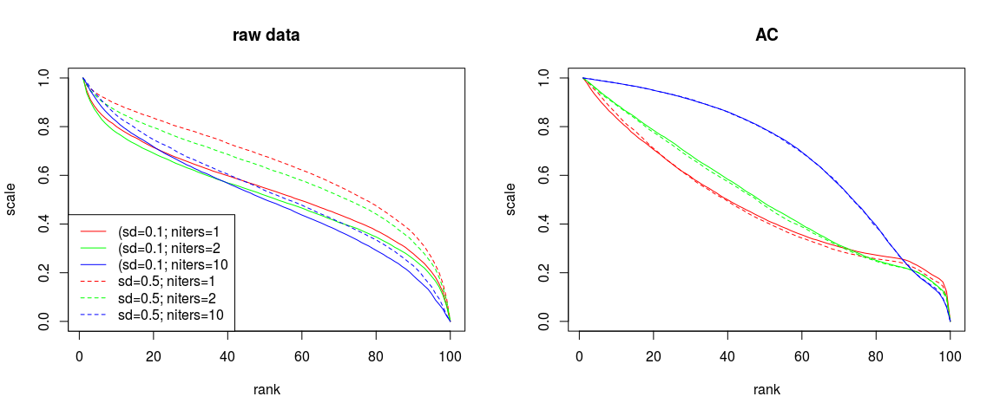
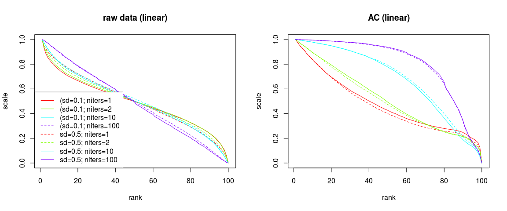

[](https://travis-ci.org/mpadge/hotspotr)
[](https://codecov.io/gh/mpadge/hotspotr)

# hotspotr

There are a number of statistical tools for evaluating the significance of
observed spatial patterns of hotspots (such as those in
[`spdep`](https://cran.r-project.org/package=spdep)). While such tools enable
hotspots to be identified within a given set of spatial data, they do not allow
quantification of whether the entire data set in fact reflects significant
spatial structuring. For example, numbers of locally significant hotspots must
be expected to increase with numbers of spatial observations. 

The `R` package `hotspotr` enables the global significance of an observed
spatial data set to be quantified by comparing both raw values and their local
spatial relationships with those generated from a neutral model. If the global
pattern of observed values is able to be reproduced by a neutral model, then any
local hotspots may not be presumed significant regardless of the values of local
statistics. Conversely, if the global pattern is unable to be reproduced by a
neutral model, then local hotspots may indeed be presumed to be statistically
significant.

The package is inspired by the work of Brown, Mehlman, & Stevens (Ecology 1995)
and Ives & Klopfer (Ecology 1997). `hotspotr` follows the same premises as these
two papers, in examining the extent to which rank--scale distributions can be
reproduced by simple neutral models. `hotspotr` compares rank--scale
distributions not only of the data of interest, but of corresponding local
autocorrelation statistics.

Analysis involves first fitting a model using the function
`fit_hotspot_model`, and then testing the significance of that using the
function `p-values`.

The remainder of this README documents various exploratory and development
phases ...

--------

# Status

- `neutral-hotspots.R` and `neutral-hotspots-ntests.R` both work in new form;
  the former is `lapply`, while the latter is `parLapply`
- `neutral-hotspots.cpp` finished, with `rcpp_neutral_hotspots` doing one test,
  and so able to be looped with `parLapply`, while
  `rcpp_neutral_hotspots_ntests` performs the loop in `C++`.
- The `C++` functions now just have to be called from an `R`-wrapper (that needs
  to be constructed ...)

--------

# Contents

[1. Brown vs Ives](#1-brown-ives) 

[2. A Spatial Version of Brown et al (1995)?](#2-brown-spatial) 

[3. Parallel and Rcpp Tests](#3-parallel)

[4. Tests](#4-tests)

--------


## Install

```{r, eval=FALSE}
devtools::install_github ('mpadge/hotspotr')
```
```{r load, echo=FALSE, message=FALSE}
while (length (grep ('hotspotr', getwd ())) > 0) setwd ("..")
#devtools::document ("hotspotr")
#devtools::check ("hotspotr")
#Rcpp::compileAttributes ("hotspotr")
devtools::load_all ("hotspotr")
setwd ("./hotspotr")
#testthat::test_package ('hotspotr')
```

--------

# <a name="1-brown-ives"></a>1. Brown vs Ives


The models of Brown and Ives are:
```{r brown-vs-ives}
brown_core <- function (ntests=10, nlayers=10, size=10, sd0=0.1)
{
    y <- lapply (seq (ntests), function (i)
                 {
                     z <- rep (1, size ^ 2)
                     for (j in seq (nlayers)) 
                         z <- z * msm::rtnorm (size ^ 2, mean=1, sd=sd0, 
                                               lower=0, upper=2)
                     z <- sort (log10 (z), decreasing=TRUE)
                     (z - min (z)) / diff (range (z))
                 })
    colMeans (do.call (rbind, y))
}

ives_core <- function (ntests=10, nlayers=10, size=10, sd0=0.1)
{
    # The following 3 parameters are fixed by Ives et al
    a0 <- 0.05 
    s0 <- 0.5
    r0 <- 1.05

    y <- lapply (seq (ntests), function (i)
                 {
                     z <- rep (1, size ^ 2)
                     for (j in seq (nlayers))
                     {
                        svec <- msm::rtnorm (size ^ 2, mean=s0, sd=sd0, 
                                             lower=0, upper=2 * s0)
                        rvec <- msm::rtnorm (size ^ 2, mean=r0, sd=sd0, 
                                             lower=0, upper=2 * r0)
                        z <- svec * z + (1 + rvec / (1 + a0 * z))
                     }
                     z <- sort (log10 (z), decreasing=TRUE)
                     (z - min (z)) / diff (range (z))
                 })
    colMeans (do.call (rbind, y))
}
```

Define a re-usable function to plot the results

```{r ploty}
ploty <- function (nt, y)
{
    plot (NULL, NULL, xlim=c (1, size^2), ylim=c(0,1), xlab="rank", ylab="scale")
    cols <- rainbow (length (nt))
    y <- lapply (seq (length (y)), function (i) 
                     lines (seq (size^2), y [[i]], col=cols [i]))
    legend ("topright", lwd=1, col=cols, legend=nt)
}
```

Then compare them both
```{r ives-vs-brown-plot, fig.width=12}
size <- 10
nlayers <- c (1, 10, 100)
ntests <- 10
yb <- lapply (nlayers, function (i) 
              brown_core (nlayers=i, ntests=ntests, size=size, sd0=1))
yi <- lapply (nlayers, function (i) 
              ives_core (nlayers=i, ntests=ntests, size=size))

plot.new ()
par (mfrow=c(1,2))
ploty (nlayers, yb)
title (main=paste ("brown"))

ploty (nlayers, yi)
title (main=paste ("ives"))
```

And the difference is clearly that Brown is able to respond to differences in
numbers of layers, while Ives remains entirely invariant. In other words, the
model of Ives et al (1997) may *not* be used as a neutral model because it is
does not respond to structural differences!

The only other variable in both cases is `sd0`

```{r ives-vs-brown-plot2, fig.width=12}
size <- 10
nlayers <- 1
sd0 <- c (0.1, 0.2, 0.5)
ntests <- 10
yb <- lapply (sd0, function (i) 
              brown_core (nlayers=nlayers, ntests=ntests, size=size, sd0=i))
yi <- lapply (sd0, function (i) 
              ives_core (nlayers=nlayers, ntests=ntests, size=size, sd0=i))

plot.new ()
par (mfrow=c(1,2))
ploty (sd0, yb)
title (main=paste ("brown"))

ploty (sd0, yi)
title (main=paste ("ives"))
```

And again, Ives does respond, but only marginally compared to Brown. Moreover,
since the product of two normal distributions is also a normal distribution,
changes in `nlayers` within the model of Brown et al (1995) are the same as
changes in the distributional variance, and so only one of these parameters
needs to be considered. The following graphs also include a Poisson distribution
for comparison.

```{r brown-plot}
size <- 10
ntests <- 100
nlayers <- c (1, 10, 100)
sd0 <- c (0.001, 0.3, 1)
ylayers <- lapply (nlayers, function (i) 
              brown_core (nlayers=i, ntests=ntests, size=size, sd0=0.1))
ysd <- lapply (sd0, function (i) 
              brown_core (nlayers=1, ntests=ntests, size=size, sd0=i))

plot (NULL, NULL, xlim=c (1, size^2), ylim=c(0,1), xlab="rank", ylab="scale")
cols <- rainbow (3)
y <- lapply (seq (length (ylayers)), function (i) 
             {
                 lines (seq (size^2), ylayers [[i]], col=cols [i])
                 lines (seq (size^2), ysd [[i]], col=cols [i], lty=2)
             })

# Poisson distribution 
yp <- dpois (seq (size^2), 1, log=TRUE)
yp <- log10 (1 + yp - min (yp)) # convert to values > 0
yp <- (yp - min (yp)) / diff (range (yp))
lines (seq (size^2), yp)

ltxt <- sapply (nlayers, function (i) paste0 ('nlayers=', i))
ltxt <- c (ltxt, sapply (sd0, function (i) paste0 ('nsd=', i)), "Poisson")
legend ("bottomleft", lwd=1, col=c (rep (cols, 2), "black"), 
        lty=c (1,1,1,2,2,2,1), legend=ltxt)
```

It's obviously far more computationally efficient to consider variance rather
than `nlayers`, and this also seems to allow a greater range of possible forms
of response. Moreover, the response with increasing variance clearly approaches
a Poisson distribution. 

Note that although increasing the variance always decreases the relative
probability of hotspots (that is, increases the width of the peak for low
ranks), increasing the number of layers always decreases it. The graph
nevertheless reveals that the response for a very large number of layers (here,
100) is accurately approximated by a very low variance (here, `sd=0.001`).


--------

# <a name="2-brown-spatial"></a>2. A Spatial Version of Brown et al (1995)

There is no 'model' to speak of in *Brown et al (1995)*, rather they merely
examine the rank-scale properties of normal distributions. Spatial relationships
may nevertheless modify such generic normal distributions, as now demonstrated.

First define a function to generate spatial autocorrelation on a grid, this time
including autocorrelation statistics as well. An additional option controls
whether values should be log-scaled or not.

Spatial autocorrelation has to be implemented by looping over the lists of
neighbours. First define the neighbourhood lists for a rectangular grid of a
given size.
```{r}
xy <- cbind (rep (seq (size), each=size), rep (seq (size), size))
dhi <- 1 # for rook; dhi=1.5 for queen
nbs <- spdep::dnearneigh (xy, 0, dhi)
```
The actual lists of neighbours (although not required anywhere in the code) can
be obtained simply as: 
```{r}
indx_nbs_to <- unlist (lapply (seq (nbs), function (i) 
                             rep (i, length (nbs [[i]]))))
indx_nbs_from <- unlist (nbs)
lens <- unlist (lapply (nbs, function (i) rep (length (i), length (i))))
head(indx_nbs_to, 10); head(indx_nbs_from, 10); head(lens, 10);
```

Then define  a function to extract the iterative lists of
neighbours (the lengths of each list are also needed):
```{r}
maxnbs <- max (sapply (nbs, length))
get_nbsi <- function (i)
{
    res <- lapply (seq (nbs), function (j)
                   {
                       if (length (nbs [[j]]) >= i)
                           c (j, nbs [[j]] [i], length (nbs [[j]]))
                       else
                           NULL
                   })
    res <- res [lapply (res, length) != 0]
    res <- do.call (rbind, res)
    data.frame (to=res [,1], from=res [,2], n=res [,3])
}
```
Then the actual loop to implement the spatial autocorrelation is:
```{r}
alpha <- 0.5
z1 <- msm::rtnorm (size ^ 2, mean=1, sd=sd0, lower=0, upper=2)
maxnbs <- max (sapply (nbs, length))
z2 <- rep (0, length (z1))
for (i in seq (maxnbs))
{
    nbsi <- get_nbsi (i)
    z2 [nbsi$to] <- z2 [nbsi$to] + ((1 - alpha) * z1 [nbsi$to] +
        alpha * z1 [nbsi$from]) / nbsi$n
}
```
This can be confirmed by manually checking the values
```{r}
z2 [1]; (1-alpha) * z1 [1] + alpha * (z1 [2] + z1 [11]) / 2
z2 [2]; (1-alpha) * z1 [2] + alpha * (z1 [1] + z1 [3] + z1 [12]) / 3
z2 [15]; (1-alpha) * z1 [15] + alpha * (z1 [5] + z1 [14] + z1 [16] + z1 [25]) / 4
```
The final function definition

```{r brown-space-definition}
sd0 <- 0.1
alpha <- 0.9
size <- 10
ntests <- 20
log_scale <- TRUE
brown_space <- function (sd0=0.5, alpha=0.1, size=10, ntests=100, 
                         niters=1, log_scale=FALSE)
{
    xy <- cbind (rep (seq (size), each=size), rep (seq (size), size))
    dhi <- 1 # for rook; dhi=1.5 for queen
    nbs <- spdep::dnearneigh (xy, 0, dhi)
    wts <- lapply (nbs, function (x) rep (1, length (x)) / length (x))

    ac_type <- 'moran'

    get_nbsi <- function (i)
    {
        res <- lapply (seq (nbs), function (j)
                       {
                           if (length (nbs [[j]]) >= i)
                               c (j, nbs [[j]] [i], length (nbs [[j]]))
                           else
                               NULL
                       })
        res <- res [lapply (res, length) != 0]
        res <- do.call (rbind, res)
        data.frame (to=res [,1], from=res [,2], n=res [,3])
    }
    maxnbs <- max (sapply (nbs, length))

    z <- lapply (seq (ntests), function (i) 
                 {
                     z1 <- msm::rtnorm (size ^ 2, mean=1, sd=sd0, lower=0, upper=2)
                     for (j in seq (niters))
                     {
                         z2 <- rep (0, size ^ 2)
                         for (k in seq (maxnbs))
                         {
                             nbsi <- get_nbsi (k)
                             z2 [nbsi$to] <- z2 [nbsi$to] + 
                                 ((1 - alpha) * z1 [nbsi$to] +
                                  alpha * z1 [nbsi$from]) / nbsi$n
                         }
                         z1 <- z2
                     }
                     if (log_scale) z2 <- log10 (z2)
                     ac1 <- rcpp_ac_stats (z2, nbs, wts, ac_type)
                     z2 <- sort (z2, decreasing=TRUE)
                     z2 <- (z2 - min (z2)) / diff (range (z2))
                     cbind (z2, ac1)
                 })

    ac1 <- colMeans (do.call (rbind, lapply (z, function (i) i [,2])))
    z <- colMeans (do.call (rbind, lapply (z, function (i) i [,1])))
    cbind (z, ac1)
}
```
Then compare different values of `alpha`


```{r brown-space}
log_scale <- FALSE
sd0 <- c (0.00001, 0.3, 1)
sd0 <- c (0.01, 0.3, 1)
size <- 10
ysd <- lapply (sd0, function (i) 
               brown_space (sd0=i, alpha=0, size=size, log_scale=log_scale))
alpha <- c (0.1, 0.5, 0.9)
yalpha <- lapply (alpha, function (i) 
               brown_space (sd0=sd0 [1], alpha=i, size=size, log_scale=log_scale))

doplots <- function ()
{
    mts <- c ("raw values", "AC")
    cols <- rainbow (length (sd0))
    ltxt <- sapply (alpha, function (i) paste0 ('alpha=', i))
    ltxt <- c (ltxt, sapply (sd0, function (i) paste0 ('sd=', i)))
    for (i in 1:2)
    {
        plot (NULL, NULL, xlim=c (1, size^2), ylim=c(0,1), xlab="rank", ylab="scale")
        title (main=mts [i])
        for (j in 1:length (sd0)) 
        {
            lines (seq (size^2), yalpha [[j]] [,i], col=cols [j])
            lines (seq (size^2), ysd [[j]] [,i], col=cols [j], lty=2)
        }
        legend ("bottomleft", lwd=1, col=rep (cols, 2), lty=c (1,1,1,2,2,2),
                legend=ltxt)
    }
}
```

```{r brown-space-plots, fig.width=12}
plot.new ()
par (mfrow=c(1,2))
doplots ()
```

Then repeat for log-scaled values
```{r brown-space-log}
log_scale <- TRUE
sd0 <- c (0.00001, 0.3, 1)
sd0 <- c (0.01, 0.3, 1)
size <- 10
ysd <- lapply (sd0, function (i) 
               brown_space (sd0=i, alpha=0, size=size, log_scale=log_scale))
alpha <- c (0.1, 0.5, 0.9)
yalpha <- lapply (alpha, function (i) 
               brown_space (sd0=sd0 [1], alpha=i, size=size, log_scale=log_scale))
```

```{r brown-space-log-plots, fig.width=12}
plot.new ()
par (mfrow=c(1,2))
doplots ()
```

And then examine the effect of multiple iterations of spatial autocorrelation

```{r brown-niters, eval=FALSE}
niters <- c (1, 2, 10, 100)
log_scale <- TRUE
sd0 <- 0.5
alpha <- 0.5
size <- 10
y1 <- lapply (niters, function (i) 
               brown_space (sd0=0.1, alpha=0.5, size=size, niters=i,
                            log_scale=log_scale))
y2 <- lapply (niters, function (i) 
               brown_space (sd0=0.9, alpha=0.5, size=size, niters=i,
                            log_scale=log_scale))
```

```{r brown-niters-plots, fig.width=12, eval=FALSE}
mts <- c ("sd0=0.1", "sd0=0.5")
cols <- rainbow (length (niters))
ltxt <- sapply (niters, function (i) paste0 ('(sd=0.1; niters=', i))
ltxt <- c (ltxt, sapply (niters, function (i) paste0 ('sd=0.5; niters=', i)))
plot.new ()
par (mfrow=c(1,2))
plot (NULL, NULL, xlim=c (1, size^2), ylim=c(0,1), xlab="rank", ylab="scale",
      main="raw data")
for (j in 1:length (niters)) 
{
    lines (seq (size^2), y1 [[j]] [,1], col=cols [j])
    lines (seq (size^2), y2 [[j]] [,1], col=cols [j], lty=2)
}
legend ("bottomleft", lwd=1, col=rep (cols, 2), lty=c (1,1,1,2,2,2),
        legend=ltxt)

plot (NULL, NULL, xlim=c (1, size^2), ylim=c(0,1), xlab="rank", ylab="scale",
      main="AC")
for (j in 1:length (niters)) 
{
    lines (seq (size^2), y1 [[j]] [,2], col=cols [j])
    lines (seq (size^2), y2 [[j]] [,2], col=cols [j], lty=2)
}
```


These functions are highly responsive, in particular to numbers of iterations,
and in particular in terms of autocorrelation statistics. Note that these
results were all generated using log-scaled values, while the linearly scaled
equivalents look like this:
```{r brown-niters-linear, eval=FALSE}
y1l <- lapply (niters, function (i) 
               brown_space (sd0=0.1, alpha=0.5, size=size, niters=i,
                            log_scale=FALSE))
y2l <- lapply (niters, function (i) 
               brown_space (sd0=0.9, alpha=0.5, size=size, niters=i,
                            log_scale=FALSE))
```
```{r brown-niters-lin-plots, fig.width=12, eval=FALSE}
mts <- c ("sd0=0.1", "sd0=0.5")
cols <- rainbow (length (niters))
ltxt <- sapply (niters, function (i) paste0 ('(sd=0.1; niters=', i))
ltxt <- c (ltxt, sapply (niters, function (i) paste0 ('sd=0.5; niters=', i)))
plot.new ()
par (mfrow=c(1,2))
plot (NULL, NULL, xlim=c (1, size^2), ylim=c(0,1), xlab="rank", ylab="scale",
      main="raw data (linear)")
for (j in 1:length (niters)) 
{
    lines (seq (size^2), y1l [[j]] [,1], col=cols [j])
    lines (seq (size^2), y2l [[j]] [,1], col=cols [j], lty=2)
}
legend ("bottomleft", lwd=1, col=rep (cols, 2), lty=c (1,1,1,2,2,2),
        legend=ltxt)

plot (NULL, NULL, xlim=c (1, size^2), ylim=c(0,1), xlab="rank", ylab="scale",
      main="AC (linear)")
for (j in 1:length (niters)) 
{
    lines (seq (size^2), y1l [[j]] [,2], col=cols [j])
    lines (seq (size^2), y2l [[j]] [,2], col=cols [j], lty=2)
}
```


And log-scaling has pronounced effects only on the structure of the raw values,
while the autocorrelation statistics remain largely unaffected.


--------

# <a name="3-parallel"></a>3. Parallel and Rcpp Tests

Five different versions are examined here:

1. A purely `R` version using `lapply`

2. A parallel equivalent using `parLapply`

3. An `R::lapply` on an internal `Rcpp` core

4. An `R::parLapply` on an internal `Rcpp` core

5. A (non-parallel) loop constructed entirely in `C++`

Fist set up grid and list of spaital neighbours
```{r}
ntests <- 10000
size <- 10
xy <- cbind (rep (seq (size), each=size), rep (seq (size), size))
dhi <- 1 # for rook; dhi=1.5 for queen
nbs <- spdep::dnearneigh (xy, 0, dhi)
```

```{r}
junk <- testn (nbs)
```

First time the pure `R` version:
```{r R-test, eval=TRUE}
set.seed (1)
st1 <- system.time (
    test1 <- neutral_hotspots (nbs=nbs, alpha=0.1, sd0=0.1, ntests=ntests)
)
```

Then an equivalent parallel version, still entirely `R`-scripted and currently
in `neutral-hotspots-ntests`:
```{r R-test-parallel, eval=TRUE}
set.seed (1)
st2 <- system.time (
    test2 <- neutral_hotspots_ntests (nbs=nbs, alpha=0.1, sd0=0.1, ntests=ntests)
)
```
That takes longer because of the time needed to establish the parallel
clusters, but the parallel version quickly becomes faster for higher values of
`ntests`.

Then current, non-parallel `Rcpp` version, called `neutral_hotspots2`, wrapped
here in an `lapply`.

```{r rloop, eval=TRUE}
rloop <- function (ntests=1000)
{
    dat <- lapply (seq (ntests), function (i) 
                 neutral_hotspots2 (nbs, alpha=0.1, sd0=0.1, ntests=ntests))
    z <- colMeans (do.call (rbind, lapply (dat, function (i) i [,1])))
    ac <- colMeans (do.call (rbind, lapply (dat, function (i) i [,2])))
    cbind (z, ac)
}
set.seed (1)
st3 <- system.time ( test3 <- rloop (ntests=ntests))
```

And then an `R`-internal parallel version. First the slightly different function
definition:
```{r rparallel-fn, message=FALSE, eval=TRUE}
require (parallel)
rParloop <- function (ntests=1000)
{
    dat <- parLapply (clust, seq (ntests), function (i) 
                    neutral_hotspots2 (nbs, alpha=0.1, sd0=0.1, ntests=ntests))
    z <- colMeans (do.call (rbind, lapply (dat, function (i) i [,1])))
    ac <- colMeans (do.call (rbind, lapply (dat, function (i) i [,2])))
    cbind (z, ac)
}
```
Note that `makeCluster` with `type="FORK"` automatically attaches all
environment variables, but is not portable, as detailed here:
[http://www.r-bloggers.com/how-to-go-parallel-in-r-basics-tips/](http://www.r-bloggers.com/how-to-go-parallel-in-r-basics-tips/).
The `clusterExport` and `clusterCall` lines explicitly attach only the required
bits.
```{r cluster-setup, eval=TRUE}
#clust <- makeCluster (parallel::detectCores () - 1, type="FORK")
clust <- makeCluster (parallel::detectCores () - 1)
clusterExport (clust, "nbs")
invisible (clusterCall (clust, function () {
                        while (length (grep ('hotspotr', getwd ())) > 0) 
                            setwd ("..")
                        devtools::load_all ("hotspotr")
                        setwd ("./hotspotr")
                                         }))
```
```{r rparallel-loop, eval=TRUE}
st4 <- system.time (test4 <- rParloop (ntests=ntests))
stopCluster (clust)
```
Then finally the whole loop over `ntests` constructed in `Rcpp`, and therefore
in non-parallel form.
```{r rcpp-loop, eval=TRUE}
set.seed (1)
st5 <- system.time (test5 <- neutral_hotspots_ntests2 (nbs, ntests=ntests))
```

The final system times are:
```{r}
st1; st2; st3; st4; st5
```

The parallel versions do not of course generate identical results, because each
core starts with its own random seed, but nevertheless after
```{r, eval=TRUE}
ntests
```
the differences are very small:
```{r, eval=TRUE}
max (abs (test1 - test2)); max (abs (test1 - test3)); max (abs (test1 - test4));
max (abs (test1 - test5))
max (abs (test2 - test3)); max (abs (test2 - test4)); max (abs (test2 - test5))
max (abs (test3 - test4)); max (abs (test3 - test5))
max (abs (test4 - test5))
```
These differences provide a measure of convergence of randomised mean profiles.


--------

# <a name="4-tests"></a>4. Tests

Test the distributional properties of the `meuse` data from the `sp` package,
which contain topsoil heavy metal concentrations near Meuse, NL.

```{r}
data (meuse, package='sp')
names (meuse)
```

The function `test_hotspots` requires data to be tested, a list of
neighbours (constructed here as `knearneigh`), and a matching list of weights
(constructed here as inverse-distance weights):
```{r meuse-data}
xy <- cbind (meuse$x, meuse$y)
nbs <- spdep::knn2nb (spdep::knearneigh (xy, k=4))
dists <- spdep::nbdists (nbs, xy)
# wts calculated in 2 steps to make it explicit
d1 <- lapply (dists, function (i) 1/i)
wts <- lapply (d1, function (i) i / sum (i))
```

Spatial patterns for the different metals can then be statistically compared
with neutral models:
```{r meuse-fn}
analyse <- function (metal='copper', ntests=1000)
{
    z <- meuse [metal] [,1]
    mod <- fit_hotspot_model (z=z, nbs=nbs, wts=wts, verbose=FALSE)
    p_values (z=z, nbs=nbs, sd0=mod$sd0, alpha=mod$ac, ntests=ntests, plot=TRUE)
}
```
For demonstration purposes, `ntests=1000` is sufficient, but larger values will
generate more reliable estimates. These functions can be quite time-consuming.
```{r meuse-cadmium, eval=FALSE}
analyse (metal='cadmium', ntests=1000)
```

```{r meuse-copper, eval=FALSE}
analyse (metal='copper', ntests=1000)
```

```{r meuse-lead, eval=FALSE}
analyse (metal='lead', ntests=1000)
```

```{r meuse-zinc, eval=FALSE}
analyse (metal='zinc', ntests=1000)
```


These plots demonstrate that in all cases, the observed values themselves (`z`
in the figures) can not be reproduced by a neutral model, yet the actual spatial
relationships between them can. This indicates that the generating processes can
be modelled by assuming nothing other than simple spatial autocorrelation acting
on a more complex, non-spatial process.
