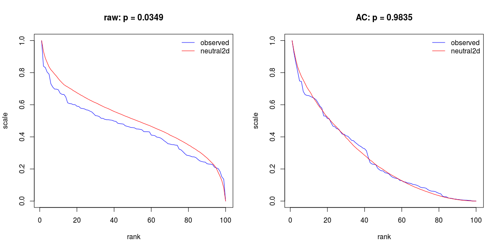
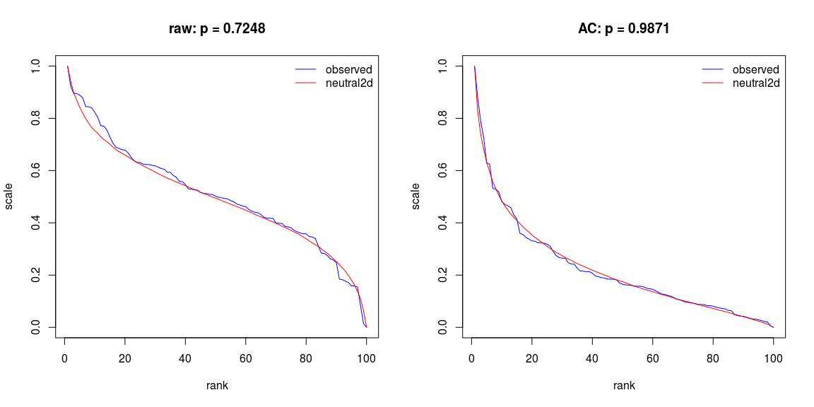

[](https://travis-ci.org/mpadge/hotspotr) [](https://codecov.io/gh/mpadge/hotspotr)

There are a number of statistical tools for evaluating the significance of observed spatial patterns of hotspots (such as those in [`spdep`](https://cran.r-project.org/package=spdep)). While such tools enable hotspots to be identified within a given set of spatial data, they do not allow quantification of whether the entire data set in fact reflects significant spatial structuring. For example, numbers of locally significant hotspots must be expected to increase with numbers of spatial observations.

The `R` package `hotspotr` enables the global significance of an observed spatial data set to be quantified by comparing both raw values and their local spatial relationships with those generated from a neutral model. If the global pattern of observed values is able to be reproduced by a neutral model, then any local hotspots may not be presumed significant regardless of the values of local statistics. Conversely, if the global pattern is unable to be reproduced by a neutral model, then local hotspots may indeed be presumed to be statistically significant.

The package is inspired by the work of Brown, Mehlman, & Stevens (Ecology 1995) and Ives & Klopfer (Ecology 1997). `hotspotr` follows the same premises as these two papers, in examining the extent to which rank--scale distributions can be reproduced by simple neutral models. `hotspotr` compares rank--scale distributions not only of the data of interest, but of corresponding local autocorrelation statistics.

Analysis involves first fitting a model using the function `fit_hotspot_model`, and then testing the significance of that using the function `p-values`.

Install
-------

``` r
devtools::install_github ('mpadge/hotspotr')
```

Test\#1
-------

First a demonstration that the model of Ives & Klopfer (Ecology 1997) can be reproduced with a simpler neutral model. This uses the function `ives` which generates random values on a square grid of dimensions `(size, size)`. The resultant ranks therefore range from 1 to 10\(\times\) 10=100.

``` r
plot.new ()
dat <- ives (size=10, seed=1)
mod <- fit_hotspot_model (z=dat$dat$z, nbs=dat$nbs)
p_values (z=dat$dat$z, nbs=dat$nbs, alpha=mod$alpha, nt=mod$nt, plot=TRUE)
```



The panel on the left shows the rank--scale distribution of the data produced by the model of Ives & Klopfer (`test data`), along with the mean rank--scale distribution of a series of neutral models. The two are highly similar, and the corresponding probability (`p=0.62`) indicates no significant difference between them. The panel on the right performs the same analysis on the local autocorrelation statistics, again revealing no significant difference with a neutral model.

The default spatial autocorrelation statistic is Moran's I, with analyses also possible using Geary's C:

``` r
plot.new ()
mod <- fit_hotspot_model (z=dat$dat$z, nbs=dat$nbs, ac_type='geary')
p_values (z=dat$dat$z, nbs=dat$nbs, alpha=mod$alpha, nt=mod$nt, ac_type='geary', 
          plot=TRUE)
```



And the Getis-Ord statistic:

``` r
plot.new ()
mod <- fit_hotspot_model (z=dat$dat$z, nbs=dat$nbs, ac_type='getis')
p_values (z=dat$dat$z, nbs=dat$nbs, alpha=mod$alpha, nt=mod$nt, ac_type='getis', 
          plot=TRUE)
```


Test\#2
-------

Then test the more complex case of the `meuse` data from the `sp` package, which contain topsoil heavy metal concentrations near Meuse, NL.

``` r
data (meuse, package='sp')
names (meuse)
```

    ##  [1] "x"       "y"       "cadmium" "copper"  "lead"    "zinc"    "elev"   
    ##  [8] "dist"    "om"      "ffreq"   "soil"    "lime"    "landuse" "dist.m"

The function `test_hotspots` requires data to be tested, a list of neighbours (constructed here as `knearneigh`), and a matching list of weights (constructed here as inverse-distance weights):

``` r
xy <- cbind (meuse$x, meuse$y)
nbs <- spdep::knn2nb (spdep::knearneigh (xy, k=4))
dists <- spdep::nbdists (nbs, xy)
d1 <- lapply (dists, function (i) 1/i)
```

Spatial patterns for the different metals can then be statistically compared with neutral models:

``` r
analyse <- function (metal='copper', ntests=1000)
{
    z <- meuse [metal] [,1]
    mod <- fit_hotspot_model (z=z, nbs=nbs)
    p_values (z=z, nbs=nbs, alpha=mod$alpha, nt=mod$nt, ntests=ntests,
              plot=TRUE)
}
```

For demonstration purposes, `ntests=1000` is sufficient, but larger values will generate more reliable estimates. These functions can be quite time-consuming.

``` r
analyse (metal='cadmium', ntests=1000)
```


``` r
analyse (metal='copper', ntests=1000)
```


``` r
analyse (metal='lead', ntests=1000)
```


``` r
analyse (metal='zinc', ntests=1000)
```


These plots demonstrate that in all cases, the observed values themselves (`z` in the figures) can not be reproduced by a neutral model, yet the actual spatial relationships between them can. This indicates that the generating processes can be modelled by assuming nothing other than simple spatial autocorrelation acting on a more complex, non-spatial process.
