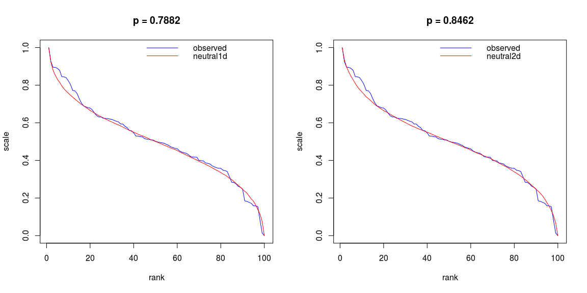

[](https://travis-ci.org/mpadge/hotspotr) [](https://codecov.io/gh/mpadge/hotspotr)

R package for estimating whether the statistical properties of a spatial pattern of hotspots may be reproduced with a simple neutral model. Currently only works for gridded data.

Install
-------

``` r
devtools::install_github ('mpadge/hotspotr')
```

Test
----

First a demonstration with a seed that produces a 2D field very similar to neutral fields.

``` r
seed <- 18
ymat <- ives2D (size=10, seed=seed)
test <- test2d (ymat, plot=TRUE)
```



Even though the raw data are similarly distributed, the spatial autocorrelation statistics are not.

Then the text output of `run_tests` for a random seed giving more typically low p-values

``` r
run_tests (size=10, ntests=1000)
```

    ##        |             differences     p-values        |                       |
    ##   dim  |  alpha      raw     AC      raw     AC      |   alpha       n       |
    ## -------|---------------------------------------------|-----------------------|
    ##   1    | (0.1, 0.1)  0.00    10.63   0.0000  0.0000  |   (0.11, 0.12)    4   |
    ##   1    | (0.1, 0)    0.00    9.84    0.0000  0.0000  |   (0.08, 0.06)    9   |
    ##   2    | (0.1, 0.1)  0.00    9.31    0.0000  0.0000  |   (0.12, 0.12)    17  |
    ##   2    | (0.1, 0)    0.00    10.68   0.0000  0.0000  |   (0.11, 0.02)    5   |
    ## ------------------------------------------------------------------------------

`run_tests` can also be used to test a neutral field against a statistial ensemble of neutral fields:

``` r
run_tests (size=10, ntests=1000, neutral=TRUE)
```

    ##        |             differences     p-values        |                       |
    ##   dim  |  alpha      raw     AC      raw     AC      |   alpha           n   |
    ## -------|---------------------------------------------|-----------------------|
    ##   1    | (0.1, 0.1)  0.00    0.55    0.0019  0.0111  |   (0.09, 0.20)    10  |
    ##   1    | (0.1, 0)    0.00    0.71    0.0030  0.0035  |   (0.12, 0.02)    9   |
    ##   2    | (0.1, 0.1)  0.00    0.20    0.0032  0.1281  |   (0.10, 0.13)    4   |
    ##   2    | (0.1, 0)    0.00    0.83    0.0025  0.0015  |   (0.12, 0.05)    10  |
    ## ------------------------------------------------------------------------------
